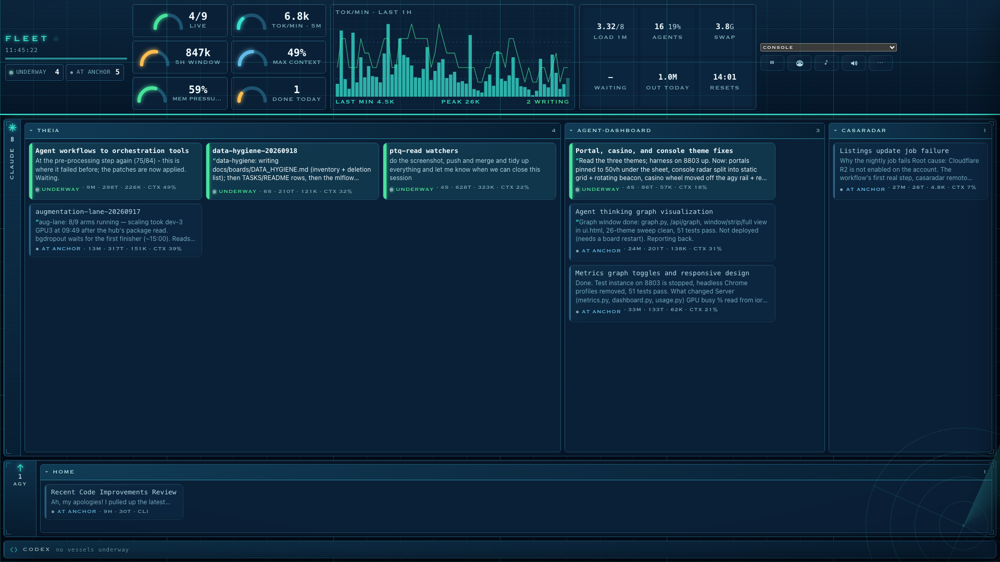
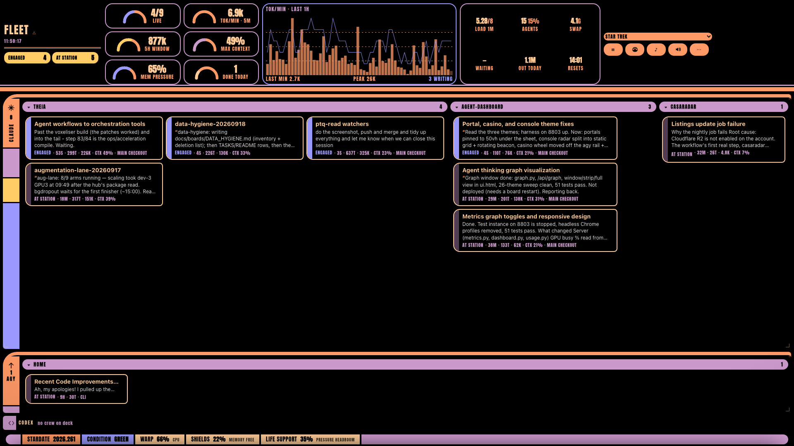

# Fleet Dashboard

**One screen for every coding-agent session on your Mac.**



Claude Code, Codex and Antigravity sessions, grouped by agent and project, each
with what it was asked to do and where it has got to — beside the machine's own
vitals. It is built to sit fullscreen on a second screen and be read from a
metre away while something else has your attention.

Nothing is installed into the agents. The board is assembled from what they
already write to disk — transcripts, job files, SQLite rows, the process table —
so no session has to report on itself, and no line on the board was summarised
by a model on demand.

## What you get

- **The board** — one tile per session: its name, what it was asked, and what it
  is doing now. Status colours are fixed across every theme: *blocked* red,
  *running* green, *idle* blue, *done* amber. Lanes and projects grow with the
  work in them, so the busy corner of the fleet takes the room.
- **The HUD** — sessions live, tokens per minute, the open five-hour Claude usage
  window, the fullest context on the board, memory pressure, and what got
  finished today. Optional panels (cpu / gpu / memory trace) switch on in
  settings when the screen has room.
- **Terminals in the page** — real shells in a docked sheet, one tab each: open
  a shell in any session's folder, attach to or resume a session, drag tabs to
  reorder. Loopback only, token-gated.
- **The graph window** — one run's trail, drawn live: a spine of model
  responses, the files it read above, the files it changed below, your prompts
  as rings. Lazy — read only when you open it.
- **26 themes** — a plain console, paper, neutral… and then Portal, Skyrim,
  Doom, LCARS, Severance, a corporate intranet and more, each an instrument
  panel over the same numbers.

  
- **A music player** — YouTube Music in a floating panel, optional.

## Install (macOS)

```bash
git clone https://github.com/abreu4/fleet-dashboard.git
cd fleet-dashboard
./install.sh        # runtime under ~/.local/share/fleet-dashboard, runs at login on :8787
./fleet.command     # open it in its own window ("Fleet Dashboard.app", also linked on the Desktop)
```

Then open <http://localhost:8787> — or the app, which is a chromeless window
that keeps the keyboard shortcuts to itself and restarts the board if it is
ever down.

- Requires macOS 12+ and Python 3.10+ (Homebrew or Anaconda Python is picked
  automatically when Apple's is too old). The app shell needs the Xcode
  command-line tools; without them the launcher falls back to Chrome.
- `./uninstall.sh` removes the login agent.
- No install at all: `python3 dashboard.py --port 8787` runs the core with no
  dependencies (only the music player's library search needs `ytmusicapi`).

Re-run `./install.sh` to deploy a new version. It restarts the board, which
hangs up the shells the board opened — run it from a terminal outside the
board, or let it detach itself (it does, when it notices).

## Using it

| | |
|---|---|
| `⌘,` | settings: tile scale, optional panels, terminal font, motion |
| `⌘E` | collapse / expand every tile to its essentials |
| `⌘G` | the graph window for the selected session |
| `⌘I` | totals: everything the fleet has written since the oldest transcript, its records, a calendar |
| `⌘J` / `` ctrl-` `` | the terminal sheet |
| `⌘T` · `⌘W` · `⌘[` `⌘]` | new shell · close tab · cycle tabs |
| click a tile | the drawer: brief, next step, tokens, model, open in iTerm / Terminal / VS Code |
| click a project header | minimise it |
| `?theme=lcars` · `?collapse=1` · `#<session-id>` | one-load overrides and deep links (theme keys are the codenames in `ui.html`: `console`, `aperture`, `e1m1`, `intranet`…) |

Two small helpers for the sessions themselves:

- **A note.** A session can leave one line that leads its tile until you prompt
  it again — drop a JSON file in `~/.fleet/notes/`:
  `{"cwd": "/path/of/the/session", "text": "waiting on review", "at": <ms>}`.
  Files, not endpoints: it works from any shell and costs the agent nothing.
- **A name.** `fleet-name <match> <new name>` renames a session from the
  terminal; `fleet-name` alone lists them.

## How it works, briefly

| Lane | Read from |
|---|---|
| Claude Code | `claude agents --json`, `~/.claude/jobs/<id>/`, the transcript under `~/.claude/projects/` |
| Antigravity | `~/.gemini/antigravity-cli/conversations/*.db`, presence locks |
| Codex | `~/.codex/state_5.sqlite`, the rollout file |
| all of them | the running process, via `ps` and `lsof` |

The snapshot is rebuilt every two seconds and the page polls every second;
transcripts are read incrementally, so a refresh costs the bytes appended since
the last one. Token counts, the usage window and the tok/min trace come from
the transcripts' own timestamps, so they survive a restart. One board runs at a
time: a copy nobody polls for half an hour exits on its own.

The full account — every field's source, the HUD's arithmetic, the layout
algorithm, the graph, the terminal, the themes — is in
[docs/DESIGN.md](docs/DESIGN.md).

## Layout of the repository

| File | What it is |
|---|---|
| `dashboard.py` | the server: snapshot loop, HTTP API, the page |
| `collectors.py` | reads the three agents' state off disk |
| `usage.py` | the token ledger: tok/min, the usage window, today |
| `totals.py` | the long record: a day-rollup in `~/.config/fleet/totals.json` that outlives the transcripts |
| `graph.py` | a run's trail for the graph window |
| `metrics.py` | host vitals: cpu, gpu, memory pressure, processes |
| `terminal.py` | the in-page shells |
| `actions.py` | "open this session" commands, assembled server-side |
| `ui.html` | the whole page, the 26 themes included |
| `install.sh` · `fleet.command` · `uninstall.sh` | deploy, open, remove |
| `fleet-browser.swift` · `fleet-icon.swift` | the app shell and its icon |
| `tests/` | `python3 -m unittest discover -s tests` |

## Safety

The board binds `127.0.0.1`. The page never sends a command string to the
server — it sends a session id or a folder plus an agent key, and the server
assembles the command from a fixed table. The terminal is gated by a
per-process token and refuses to start when the server binds anything but
loopback. YouTube Music credentials, if you add them, are stored in
`~/.config/fleet/ytmusic.json` with mode `0600` and never returned by any
endpoint.

To serve the board on the LAN (without terminals): `python3 dashboard.py --host 0.0.0.0 --port 8787`.
